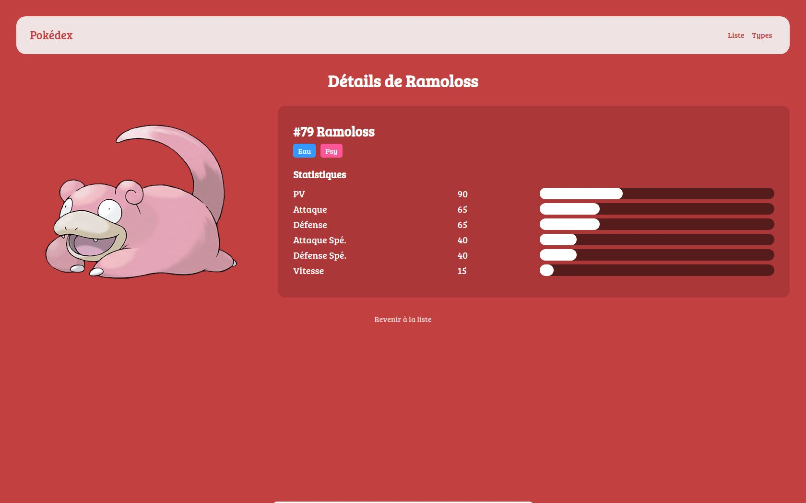

# Pokédex

Bienvenue dans le projet Pokédex ! L'objectif de ce projet est de créer un Pokédex en utilisant PHP, MySQL, HTML/CSS et le framework AltoRouter.

## Description

Ce Pokédex est une application web permettant de visualiser la liste des Pokémon de la première génération avec leurs détails. Chaque Pokémon possède des caractéristiques de combat, appelées statistiques, ainsi qu'un ou deux types (plante, roche, feu, etc.). Les données des Pokémon sont stockées dans une base de données MySQL et sont récupérées à l'aide de requêtes SQL.

## Fonctionnalités

- Liste complète des Pokémon gen1.
- Affichage des détails d'un Pokémon, comprenant ses statistiques et son/ses type(s).
- Filtrage des Pokémon par type.
- Interface utilisateur responsive pour une expérience fluide sur différents appareils.

## Screenshots

## Instructions

### Installation

1. Clonez ce dépôt.
2. Configurez votre serveur web pour utiliser le fichier `.htaccess` pour la réécriture d'URL (Apache) ou un équivalent pour d'autres serveurs.
3. Importez la base de données à partir du fichier `pokedex.sql` fourni.
4. Mettez à jour les informations de connexion à la base de données dans le fichier `config.ini` (renommez config.ini.dist en config.ini).
5. Installez les dépendances en exécutant la commande `composer install`.

### Utilisation

- Accédez à la page d'accueil pour voir la liste complète des Pokémon.
- Cliquez sur un Pokémon pour afficher ses détails.
- Cliquez sur le type d'un Pokémon pour afficher la liste des Pokémon du même type.
- Utilisez les liens de navigation pour afficher tous les types ou les Pokémon sous forme de liste détaillée.

## Remarques

Ce projet a été réalisé dans le cadre d'un exercice pour pratiquer les interactions avec les bases de données MySQL en utilisant PHP. Il suit le modèle MVC (Modèle-Vue-Contrôleur) pour une meilleure organisation du code.

## Auteur

Mounir Boumaza
